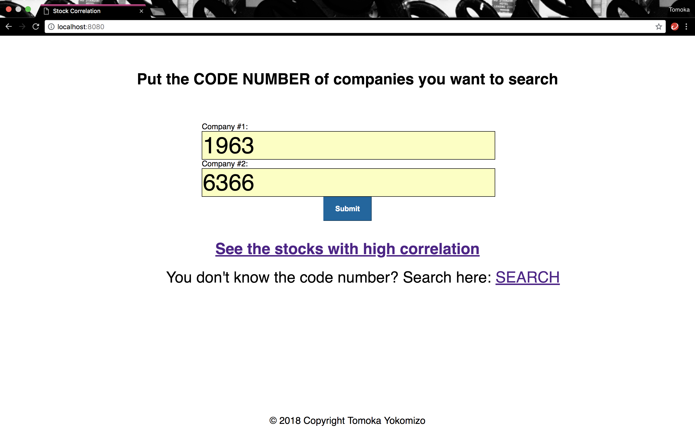
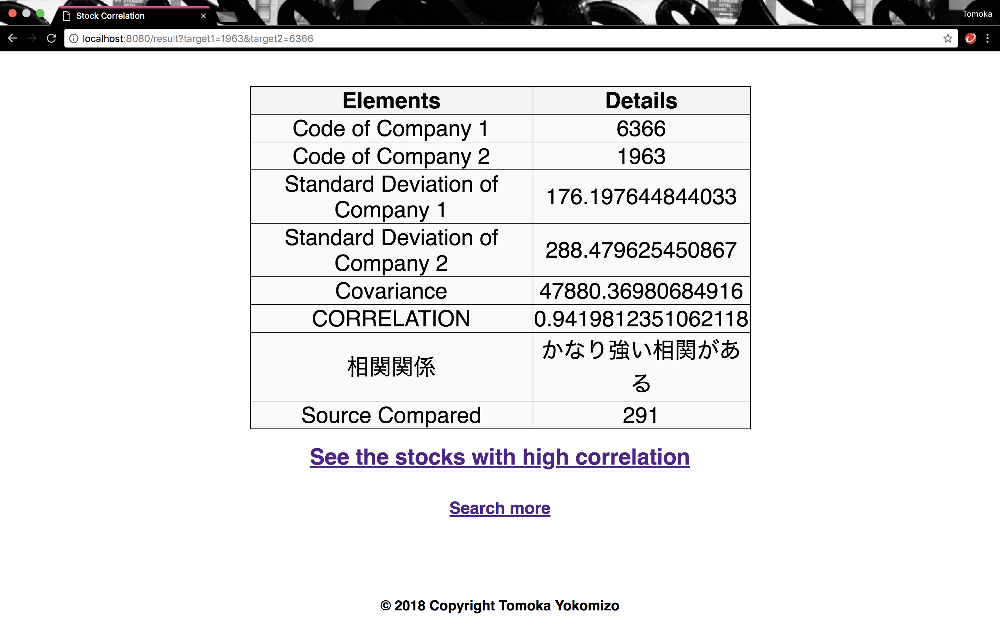
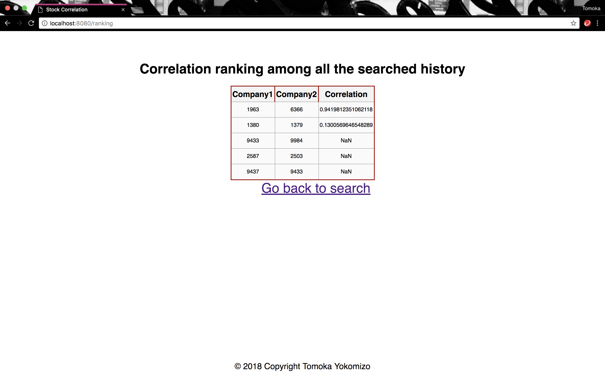

# stock_correlation

## first you need to search for 2 company codes via link provided.

## result will show you the correlation of the two companies' stock you have chosen

## all the searched result will be saved in Appengine. and this page will show you the correlation ranking among all the saved data.

### Data used to analyze the correlation is based on the link http://www.net-ir.ne.jp/cgi-bin/prv/search.cgi?cord=&k=c&mk=-&nr=-&v=10&c=1 provided by Nomura.
